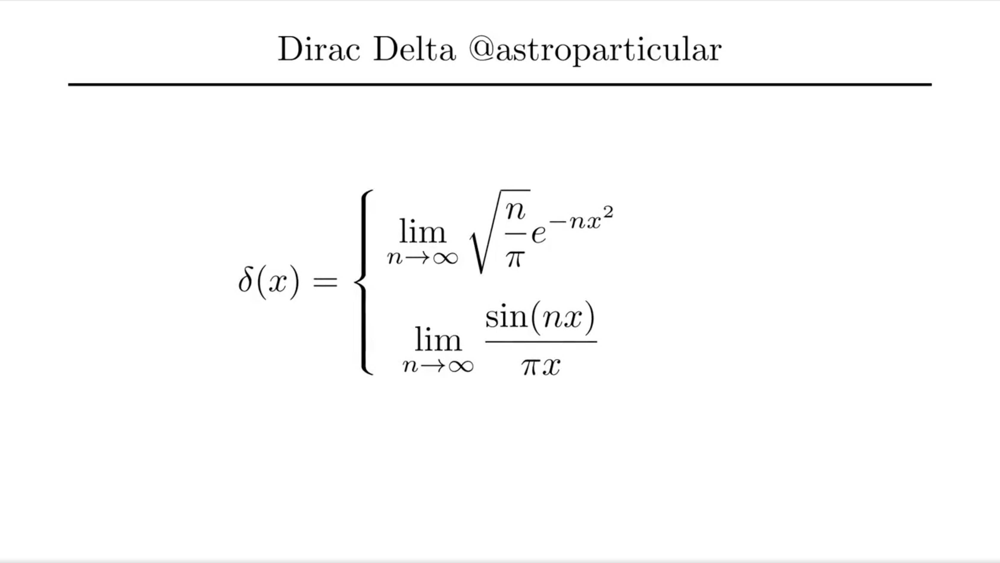
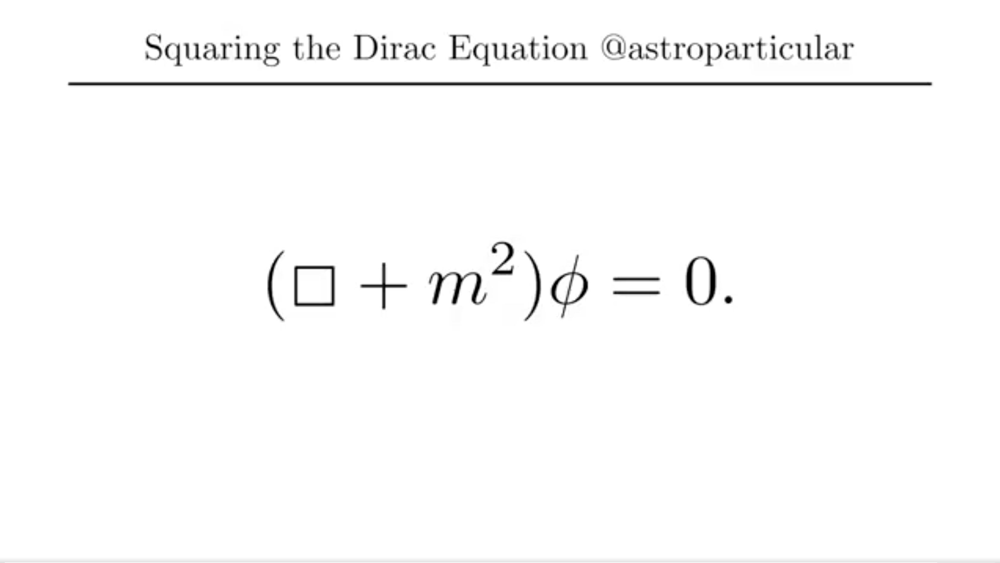
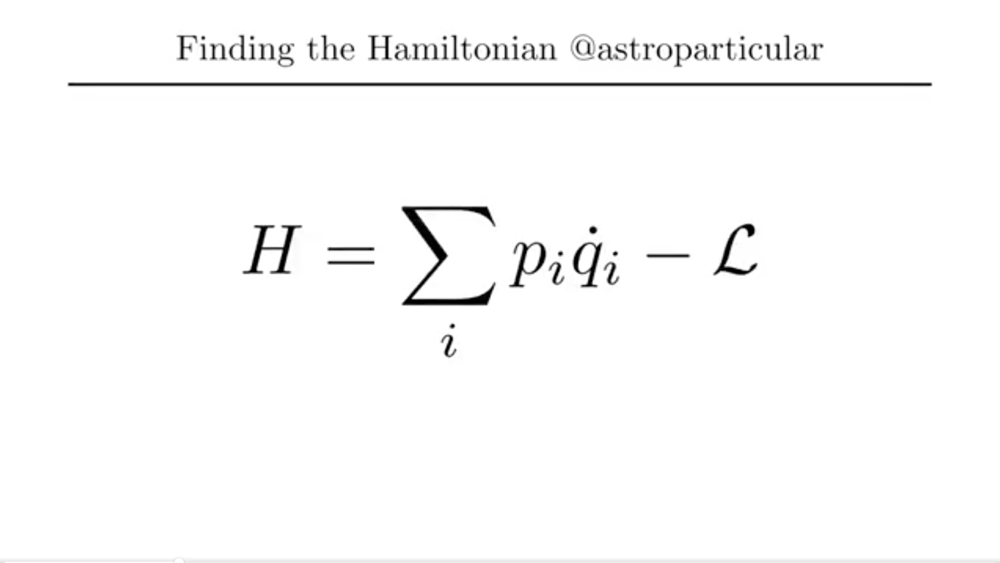
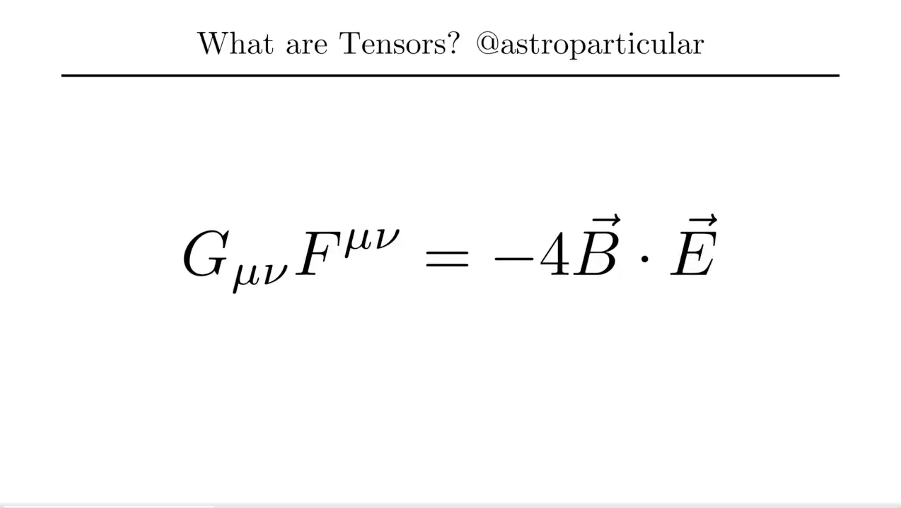

Here's the [github repository](https://github.com/isoleph/twitter) containing the python code I used to create Science Communication animations on my twitter [@astroparticular](https://www.twitter.com/astroparticular) Most of this is done using 3Blue1Brown's math animation engine, [manim](https://github.com/3b1b/manim). One of the biggest compliments I've received is university professors using my animations to present derivations in their lectures.

  

    
    
    
    
  

