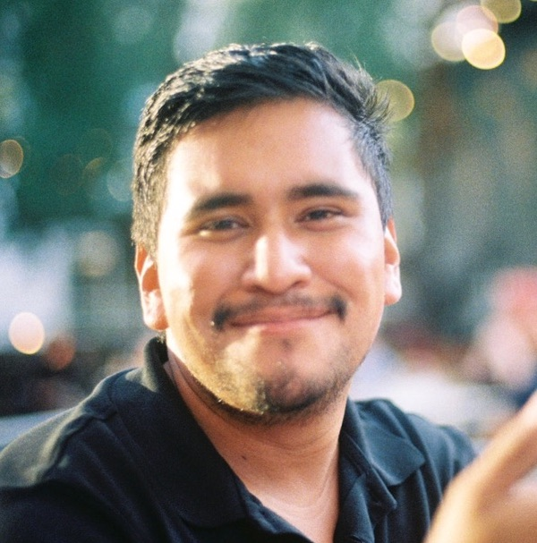

I was born in Baja California, Mexico to two parents descended from Mexican farmers. Since emigrating to the United States, I've lived in sunny Southern California ever since. 

Ever since high school, I've had a passion for music and the arts---being involved with the Torrance High School Marching Band, Jazz Band, Wind Ensemble and Fine Arts Club. In university, I was involved with the UCSB Literature Club, Poet's Club, and Writer's Workshop-- all while pursuing my interest in physics and French while taking engineering coursework on the side. In 2019, I graduated with a Bachelors of Science in Physics and a minor in French, winning a UCSB French Department award in 2016.

My diverse array of experiences ranging from facilitating Writer's Workshops that guide new authors into bringing their writing into the world, or my experiences tutoring children from six to sixteen in Math and Science---have all given me the ability to demystify complex ideas and easily communicate them. After university, I picked up the hobby of utilizing Python towards science communication and demystifying undergraduate and graduate level physics concepts via Twitter threads!

My interests are in using my analytical skills towards data analysis, or to apply those skills in a lab setting where they may be most useful. Eventually, I plan on continuing my physics education or on venturing into a new STEM-related field where I can conduct impactful work that helps people.
